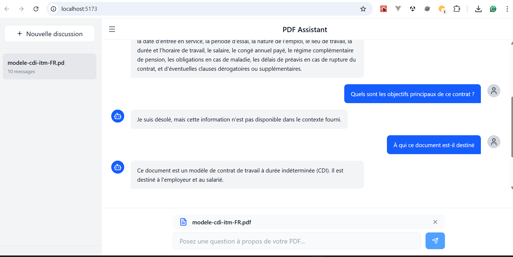

# RAG Frontend (Retrieval-Augmented Generation)


This frontend is built with **React + TypeScript + Vite** and provides a user-friendly interface to interact with the RAG backend. Users can upload PDFs, ask questions, and view AI-generated answers strictly based on the PDF content.

## 🚀 Features

- Chat-like interface to ask questions and display AI responses.
- Drag & drop PDF upload with file type and size validation (max 5 MB).
- Local conversation management.
- Sends requests to the backend at `http://localhost:3000/rag`.

## 🛠 Technical Overview

**Framework:** React + Vite + TypeScript

**Key Components:**

- `PDFUploadArea` — drag & drop PDF upload, validation.
- `ChatMessages` — displays the conversation messages.
- `App.tsx` — main chat logic and API integration.

**API Integration:**

- Sends `FormData` containing:

  - `file`: PDF (application/pdf)
  - `ask`: question string

**Response format:**

```json
{
  "ask": "string",
  "davIa": "string"
}
```

## ⚡ Prerequisites

- Node.js >= 18
- pnpm (or npm/yarn, but scripts assume pnpm)

## 💻 Installation (Development)

```bash
cd rag-front
pnpm install
pnpm run dev
```

Frontend is usually available at [http://localhost:5173](http://localhost:5173) and communicates with the backend at `http://localhost:3000`.

## 📦 Build / Production

```bash
cd rag-front
pnpm run build
pnpm run preview  # serve the dist folder via a static server
```

## 📂 Key Files

- `src/App.tsx` — main chat logic
- `src/components/pdf-upload-area.tsx` — PDF upload UI
- `src/components/chat-messages.tsx` — chat message display

## ⚠️ Notes

- AI responses are strictly based on the content of uploaded PDFs.
- Large PDFs may increase memory usage.
- Drag & drop only supports valid PDF files up to 5 MB.
